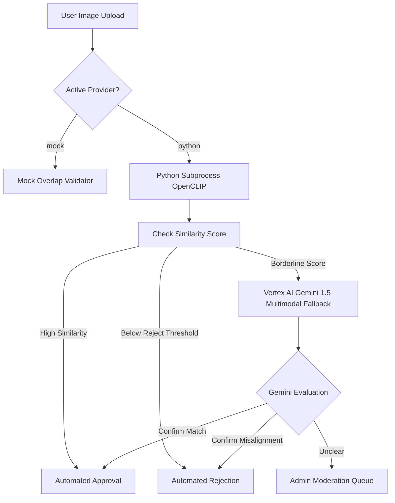

# AI Architecture Blueprint

This document details the current and future artificial intelligence validation pipelines for verifying Daily Theme drawing challenge submissions.

---

## 1. Executive Summary & Status
*   **Current Status**: **Fully Implemented locally** with Python subprocess OpenCLIP. **Planned** for Google Vertex AI fallback integration.
*   **Files Inspected**: `src/lib/theme-validation/python-validator.ts`, `ml/image_theme_validator/validate_image_theme.py`.
*   **Target State**: A highly robust, hybrid dual-layer verification system combining high-throughput local feature matchers with cognitive LLM visual checks.

---

## 2. Dual-Engine Validation Pipeline


---

## 3. Local OpenCLIP Subprocess Worker
*   **Path**: [`ml/image_theme_validator/validate_image_theme.py`](file:///Users/danielebiggi/Desktop/fcbc-main/creator-style-lab/ml/image_theme_validator/validate_image_theme.py)
*   **Model Options**:
    *   Primary: `open_clip` `ViT-B-32` pre-trained on `laion2b_s34b_b79k`.
    *   Fallback: HuggingFace `transformers` CLIP model `openai/clip-vit-base-patch32`.
*   **Execution Mechanics**: Next.js launches a non-interactive node subprocess, writing image streams to stdin and reading JSON outputs from stdout to prevent memory-leak overhead.

---

## 4. Google Vertex AI / Gemini 1.5 Fallback
*   When a submission similarity score lands in the "borderline" or grey zone (between `rejectThreshold` and `acceptThreshold`), the system makes a secure API request to Google Vertex AI.
*   **Model**: `gemini-1.5-pro` or `gemini-1.5-flash`.
*   **Payload**: The uploaded drawing image (Base64) alongside a strict system prompt:
    ```
    Evaluate if this drawing matches the user challenge: "[Theme Text]".
    Respond strictly in JSON with fields:
    - is_aligned: boolean
    - reasoning: string (maximum 15 words explaining alignment)
    - interpretation: "literal" | "symbolic" | "abstract" | "emotional"
    ```

---

## 5. Local Development Behavior
*   For offline local development, the system avoids Vertex AI API costs by defaulting the fallback mechanism to the `mock` prompt generator or immediately routing borderline submissions to the local `/admin/daily-theme` queue.

---

## 6. Open Questions
*   How should we handle potential Vertex AI rate-limiting or service-interruption errors?
*   What is the maximum token-cost budget per daily challenge submission?
