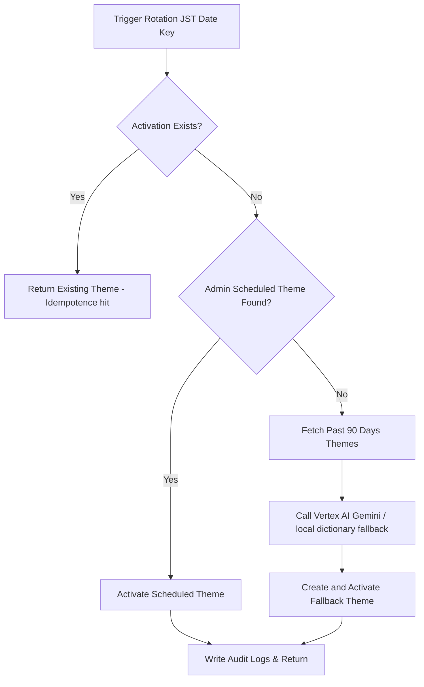

# Phase 4 Architecture: Automatic Daily Theme Rotation

This document explains the technical design, timezone handling, background execution, and security architecture of the automatic daily drawing challenge rotation system.

---

## 1. Timezone Mechanics

The product timezone is locked strictly to **`Asia/Tokyo`** (JST). All challenges are activated exactly at midnight Tokyo time (`00:00:00 JST`).
- Local system times and browser local time offsets are fully decoupled from database storage.
- Date boundary calculation is computed natively using `Intl.DateTimeFormat` configured with timezone `"Asia/Tokyo"`.

---

## 2. Idempotence & Race Condition Prevention

Background crons run in highly distributed environments (e.g. Google Cloud Run). Multiple requests can trigger concurrently.
To enforce a strict limit of **exactly one active challenge per Japan date**, we introduced:
1.  **`DailyThemeActivation` Model**: Represents a mapping event of a theme to a specific Japan date key.
2.  **Strict Database Constraint**: A `@unique` index on `dateKey` (e.g. `"2026-07-10"`).
3.  **Serialized Database Transactions**: A `prisma.$transaction` query sequence that checks, locks, and writes activations. If a secondary thread attempts a collision write, the transaction triggers a primary key violation (P2002), which is caught, handled gracefully, and fallbacks to reusing the already-activated theme.

---

## 3. Orchestration Priority Flow

Each day at 00:00 JST, the daily rotation service:

---

## 4. Secure Cron Execution Worker

The rotation background worker is triggered via HTTP POST request:
- **Trigger endpoint**: `/api/jobs/rotate-daily-theme`
- **Authentication**: Secured using standard GCP IAM OIDC token claims and request bearer secrets. Unauthenticated public requests are rejected.
- **Scheduler**: Google Cloud Scheduler triggers this endpoint daily with configured IAM invoker service credentials.
